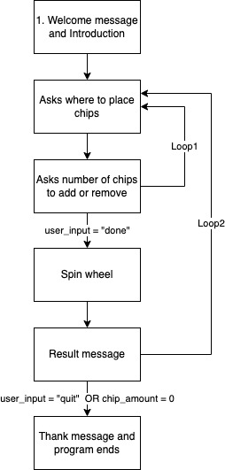
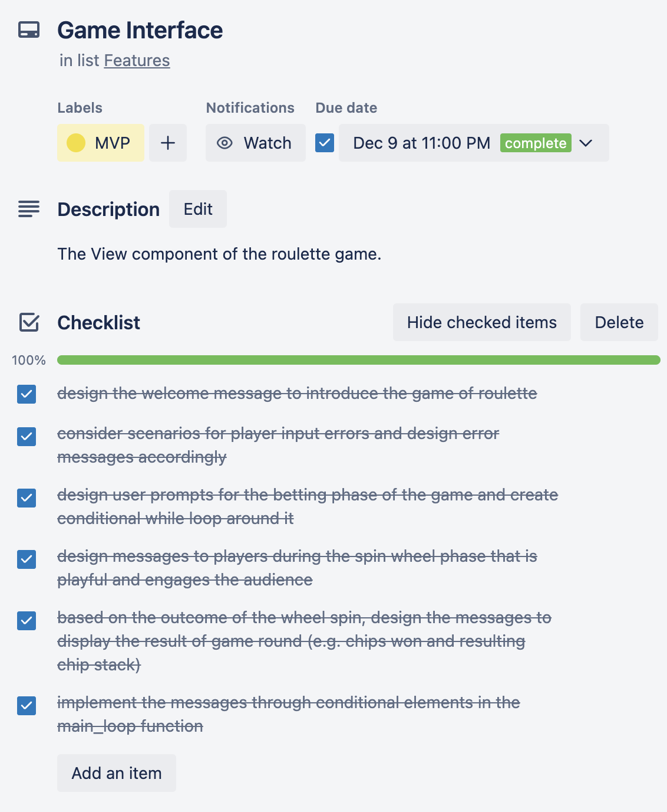
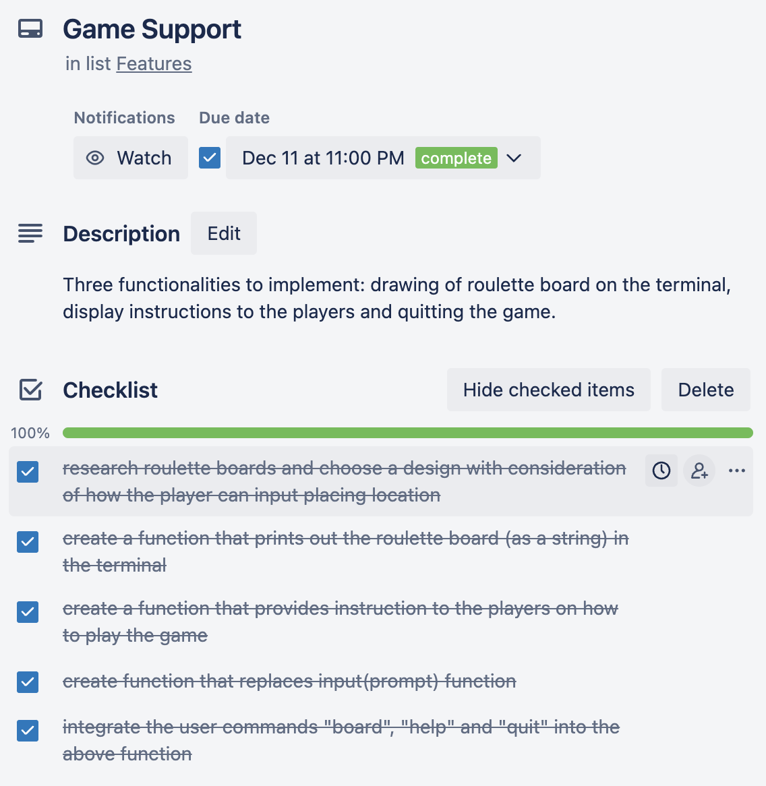
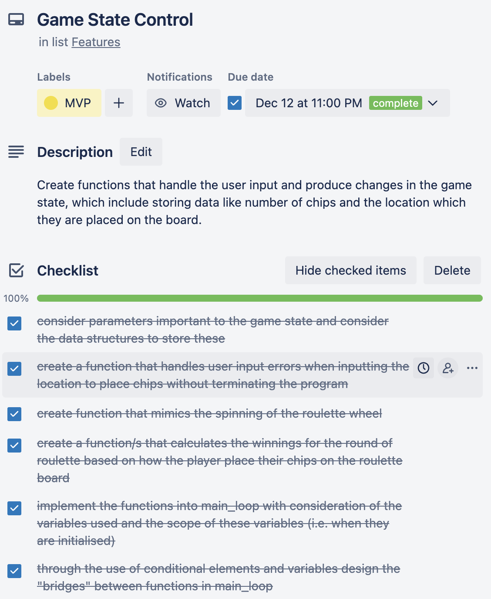

# roulette - Python Terminal Application Documentation
## Introduction
This application simulates the classic casino of Roulette. The game involves betting chips on board with numbers ranging from 0 to 36. The player can choose to bet on a single number or a group of numbers. Each round, the roulette wheel spins and a number is selected (0 to 36). If you have betted on the selected number, you will receive a payout of chips. The purpose of this application is for people to enjoy this game without any monetary commitment. The terminal application was developed on Python version 3.9.6. The code structure follows the Model-View_Controller (MVC) pattern where:

- Model: storage of the game state in variables of different data structures
- Controller: update of the game state through the use of created functions
- View: player's viewpoint of the game which involves the prompts and messages shown to the players.

## Installation Guide
In order to access the source code and perform other development activities, please download Python 3 using this [guide](https://wsvincent.com/install-python/).

### Installing on MacOS
Since this application was developed on MacOS, the created roulette.exe file can only be executed on MacOS.

1. Download the zip file from the roulette [repository](https://github.com/johnsonw1017/roulette), by clicking on the green "Code" button then "Download ZIP.
2. Once the folder is unzipped, ctrl-click on the roulette Unix Executable file then click "Open". The game should open in default terminal on the computer.

### Installing on Windows

1. Download the zip file from the roulette [repository](https://github.com/johnsonw1017/roulette), by clicking on the green "Code" button then "Download ZIP.
2. Once the folder is unzipped, the roulette.py can be converted to an executable file on cmd by following this [guide](https://www.geeksforgeeks.org/convert-python-script-to-exe-file/).
3. Open the created .exe file.

## Features
### 1. Game Interface
This feature relates to the function main_loop which when run forms the user interface of the game in the terminal. This involves regulating the player interactions like providing the game play prompts and responding to the player inputs. The flow of the game can be summarised in the following figure:

Note that there are 2 loops present (labelled Loop1 and Loop2), the conditions to exit the loops are listed in the arrows heading downwards. One loop through Loop2 is one round of the game.

### 2. Game Internals

These features relate to the functions, variables and data structures used to control and store the game state of the application. The following table summarises the functions created and their output.

| Functions| Input arguments| Purpose | Output |
|----------|----------------|---------|--------|
|is_location|location (str)|Helps with handling user input errors when the player provides the location to place their chips.|Returns True (bool) if the location supplied by the player is valid and False (bool) otherwise.
|spin_wheel| |Selects a number for the round and displays it for the players.|Returns selected_number (int), a random number between 0 and 36.|
location_to_number|location (str)|Based on the location supplied by the player, this function determine the numbers on the roulette board to place the bets on.|Returns betted_numbers (list), a list of numbers that have been betted.|
calculate_winnings|chip_placement (dict)|Based on the player’s chip placement in the betting phase. This function calculates the payout for each number if it gets selected.|Returns winnings (list), a list with length of 37, each represents the payout rate for numbers 0 to 36 consecutively.

The following table summarises the important data structures and variables that store the game state.

|Data Structures|Game state that is stored|
|---------------|-------------------------|
|chip_placement (dict)|Stores where the chips are placed on the roulette board, reinitialised each round. Key: location (str) Value: num_chips (int)|
|winnings (list)|Stores the payout rate for each number on the roulette board, reinitialised each round. For example winnings[2] would be the payout of chips if the number 2 is selected by the wheel.|
|num_spins (int)|Stores the number of rounds the players has played.|
|num_chips (int)|Number of chips in the player’s chip stack.|

### 3. Game Support

Each time the player is prompt for a input, the player can type some commands to request for some help. This include:
- "board" - to view the roulette board
- "help" - to view game instructions
- "quit" - to quit the game

The functions related to this feature is listed in the table below.

|Functions|Input arguments|Purpose|Output|
|---------|---------------|-------|------|
|get_input|prompt (str)|This function is called each time the player is prompted for an input. It looks for the user commands and responds accordingly through conditional statements|Returns user_input (str) which is the string the player inputs when prompt.|
|draw_board||Displays the roulette board to players.|Prints a string of the roulette board in the terminal.|
|print_instruction||Display game instructions for the players.|Prints a string with instructions on playing roulette.|

## Valid Location Inputs
The following table shows the valid location inputs based their betting types.

| Betting Type | Valid Location Inputs | Example |
|--------------|-----------------------| :---: |
| Single number | Number ranging from 0 to 36 | 5 |
| Edges | To bet 2-3 numbers at a time, use "u", "d", "l" or "r" then followed by a number for the upper, lower, left or right edges next to the number respectively | l23 |
| Corners | To bet 3-4 numbers at a time, use "c" then followed by the largest number of the set. | c24 |
| Number groups | Bet as appeared on the roulette board | RED |

## Implementation Plan - Feature Checklists
### Game Interface
- design the welcome message to introduce the game of roulette
- consider scenarios for player input errors and design error messages accordingly
- design user prompts for the betting phase of the game and create conditional while loop around it
- design messages to players during the spin wheel phase that is playful and engages the audience
- based on the outcome of the wheel spin, design the messages to display the result of game round (e.g. chips won and resulting chip stack)
- implement the messages through conditional elements in the main_loop function

### Game Internals
- consider parameters important to the game state and consider the data structures to store these
- create a function that handles user input errors when inputting the location to place chips without terminating the program
- create function that mimics the spinning of the roulette wheel
- create a function/s that calculates the winnings for the round of roulette based on how the player place their chips on the roulette board
- implement the functions into main_loop with consideration of the variables used and the scope of these variables (i.e. when they are initialised)
- through the use of conditional elements and variables design the "bridges" between functions in main_loop

### Game Support
- research roulette boards and choose a design with consideration of how the player can input placing location
- create a function that prints out the roulette board (as a string) in the terminal
- create a function that provides instruction to the players on how to play the game 
- create function that replaces input(prompt) function
- integrate the user commands "board", "help" and "quit" into the above function

## Trello Screenshot
The implementation plan was placed on Trello for progress tracking purposes. Below are some screenshot from the Trello board, including due dates set for each task.

## Links
- [GitHub Respository](https://github.com/johnsonw1017/roulette)
- [Presentation](https://youtu.be/9ZgzezI2Xt4)